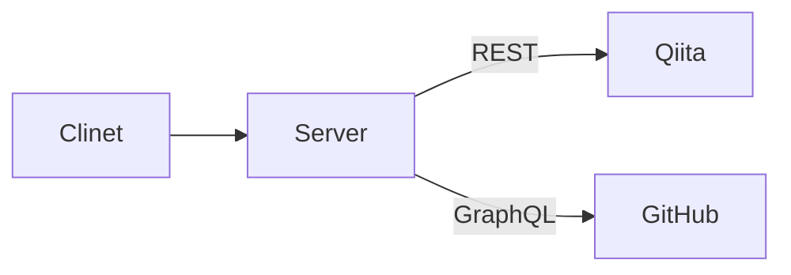

# Deploy a SolidJS App to Cloudflare.

このメモは、SolidJS/SolidStart で Web Application を実装した時にまとめたものです。

SolidJS で SSR を試します。



Topic は以下のとおりです。

- [SolidJS](https://github.com/solidjs/solid)
- [SolidStart](https://github.com/solidjs/solid-start)
- TypeScript
- Cloudflare Pages

さらに詳しく見たい方は読み続けてください。

---

2023年9月3回目です。

この数ヶ月、Svelte、Remix、Qwik、VanJS、Astro を検証してきました。

これらの Framework を触った感触が鮮明なうちに SolidJS を検証します。

今回作成したコードは[こちら](https://github.com/danny-yamamoto/my-portfolio-solidjs-ts)です。

https://github.com/danny-yamamoto/my-portfolio-solidjs-ts

https://my-portfolio-solidjs-ts.pages.dev/

## 環境構築
- VS Code の devcontainer で構築しています。
- Version 情報
   - Node.js: `v20.5.0`
   - SolidJS: `1.7.11`

<details><summary>npm init solid@latest</summary>

```bash
yamamoto_daisuke@instance-1:~/solidjs$ sudo npm init solid@latest

create-solid version 0.2.31

Welcome to the SolidStart setup wizard!

There are definitely bugs and some feature might not work yet.
If you encounter an issue, have a look at https://github.com/solidjs/solid-start/issues and open a new one, if it is not already tracked.

✔ Where do you want to create the app? … my-portfolio-solidjs-ts
✔ Which template do you want to use? › bare
✔ Server Side Rendering? … yes
✔ Use TypeScript? … yes
found matching commit hash: fced756050aece04e7e7260802a25164ed6de7ae
/root/.degit/github/solidjs/solid-start/fced756050aece04e7e7260802a25164ed6de7ae.tar.gz already exists locally
extracting /examples/bare from /root/.degit/github/solidjs/solid-start/fced756050aece04e7e7260802a25164ed6de7ae.tar.gz to /home/yamamoto_daisuke/solidjs/my-portfolio-solidjs-ts/.solid-start
cloned solidjs/solid-start#main to /home/yamamoto_daisuke/solidjs/my-portfolio-solidjs-ts/.solid-start
✔ Copied project files

Next steps:
  1: cd my-portfolio-solidjs-ts
  2: npm install
  3: npm run dev -- --open

To close the dev server, hit Ctrl-C
yamamoto_daisuke@instance-1:~/solidjs$
```

</details>

- 開発サーバーを起動します。
   - あとで述べる Adapter は、外した状態です。

<details><summary>npm run dev</summary>

```bash
node ➜ /workspaces/my-portfolio-solidjs-ts (main) $ npm run dev

> dev
> solid-start dev

 solid-start dev 
 version  0.3.5
 adapter  node

  VITE v4.4.9  ready in 7349 ms

  ➜  Local:   http://localhost:3000/
  ➜  Network: use --host to expose
  ➜  Inspect: http://localhost:3000/__inspect/
  ➜  press h to show help

  ➜  Page Routes:
     ┌─ http://localhost:3000/*404
     └─ http://localhost:3000/

  ➜  API Routes:
     None! 👻
```

</details>

## Project 構成

<details><summary>Project Structure</summary>

```bash
.
├── package.json
├── package-lock.json
├── public
│   └── favicon.ico                    # edit
├── README.md
├── src
│   ├── components                     # add
│   │   ├── Articles.tsx               # add
│   │   ├── Experience.tsx             # add
│   │   ├── Footer.tsx                 # add
│   │   ├── Introduction.tsx           # add
│   │   └── Repositories.tsx           # add
│   ├── entry-client.tsx
│   ├── entry-server.tsx
│   ├── global.d.ts
│   ├── root.css                       # edit
│   ├── root.tsx
│   ├── routes
│   │   ├── [...404].tsx
│   │   └── index.tsx                  # edit
│   ├── types.ts                       # add
│   └── utils                          # add
│       ├── articles.server.tsx        # add
│       ├── experience.server.tsx      # add
│       └── repositories.server.tsx    # add
├── tsconfig.json
└── vite.config.ts                     # edit
```

</details>

## Framework 間の比較
### 環境変数
- SolidJS
   - Vite の `import.meta.env` オブジェクトから取得します。
      - [Vite 環境変数とモード](https://ja.vitejs.dev/guide/env-and-mode.html)
- Remix
   - Remix の `context` 経由で取得します。
      - [Remix Environment Variables](https://remix.run/docs/en/main/guides/envvars#environment-variables)

### Component 間での受け渡し
- SolidJS
   - 子 `Component` で props をラップして受け取ります。React 似ています。この例では、`interface` を用いています。

https://github.com/danny-yamamoto/my-portfolio-solidjs-ts/blob/6b684ae055e5a1f09ec35b3e092acdc86f078604/src/components/Articles.tsx#L4-L17

- Remix
   - 親 Component から props で受け取ります。

https://github.com/danny-yamamoto/my-portfolio-remix-ts/blob/1262e4634c4a2e408066bfe41fc356b6d459b1ca/app/components/Articles.tsx#L8-L23

### サーバ上でのデータ取得
- SolidJS
   - `routeData()` 関数を使用します。`routeData()` 関数で取得したデータを Component で使用できます。

https://github.com/danny-yamamoto/my-portfolio-solidjs-ts/blob/6b684ae055e5a1f09ec35b3e092acdc86f078604/src/routes/index.tsx#L22-L41

- Remix
   - `loader()` 関数を使用します。`useLoaderData()` 関数で取り出すことができます。Component の描画のタイミングで取り出し、画面の描画に利用できます。

https://github.com/danny-yamamoto/my-portfolio-remix-ts/blob/1262e4634c4a2e408066bfe41fc356b6d459b1ca/app/routes/_index.tsx#L41-L59

## Deploy a SolidJS site
- この環境では、Adapter を install したまま起動することができません。原因を確認中です。
- 公式の [Docs](https://developers.cloudflare.com/pages/framework-guides/deploy-a-solid-site/#use-bindings-in-your-solid-application)の通り、`vite.config.ts` ファイルに Adapter を追加します。

## Summary
- SolidJS について書きました。
- 他の Framework と比較すると、Knowledge は少ない印象です。ググってもあまり出てきません。
- Cloudflare Adapter でのローカル環境での `npm run dev` が失敗する件は、別途調べたいと思います。
- SolidStart は、Major Version ではないため、もう少し様子を見る必要があると思いました。

この投稿をみて何か得られた方は、いいね ❤️ をお願いします。

それでは、また別の話でお会いしましょう。👋
